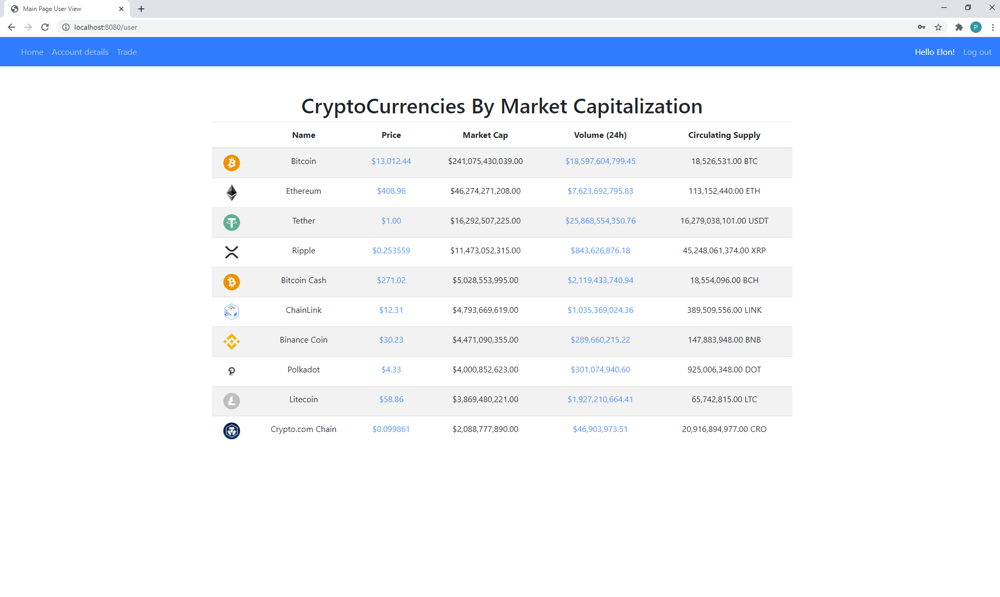
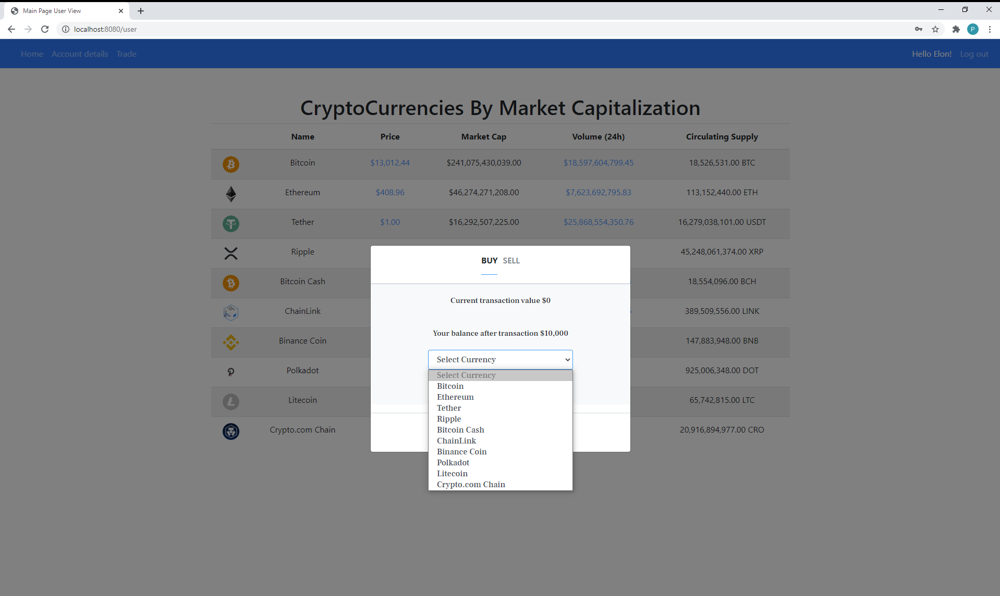
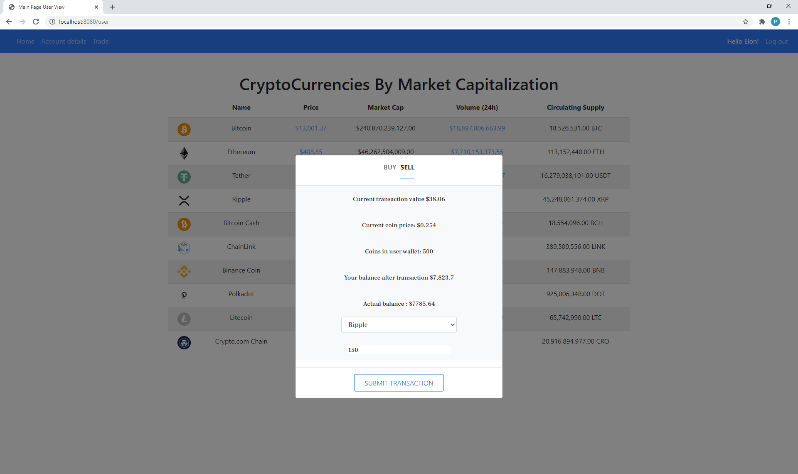
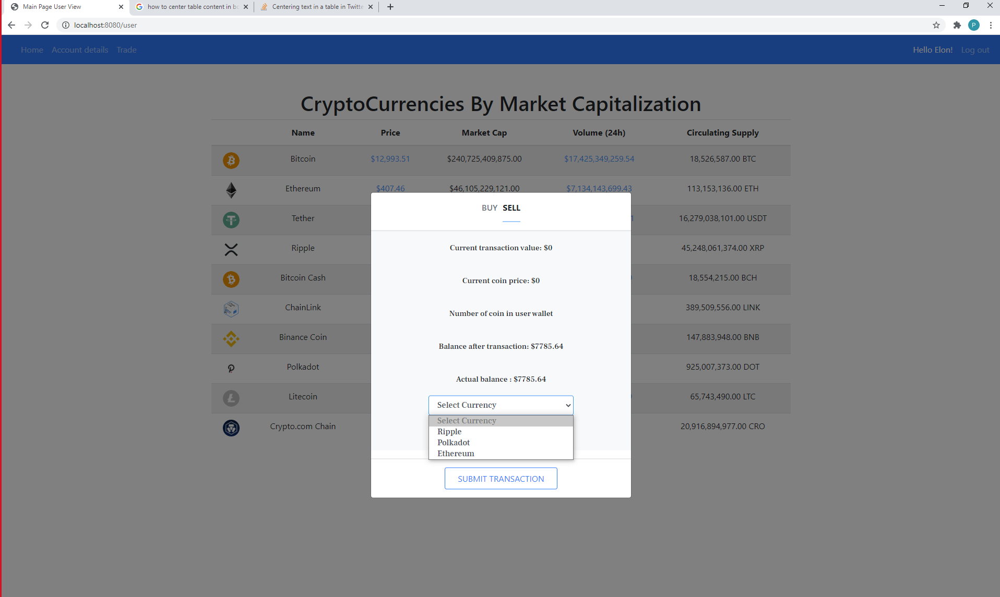
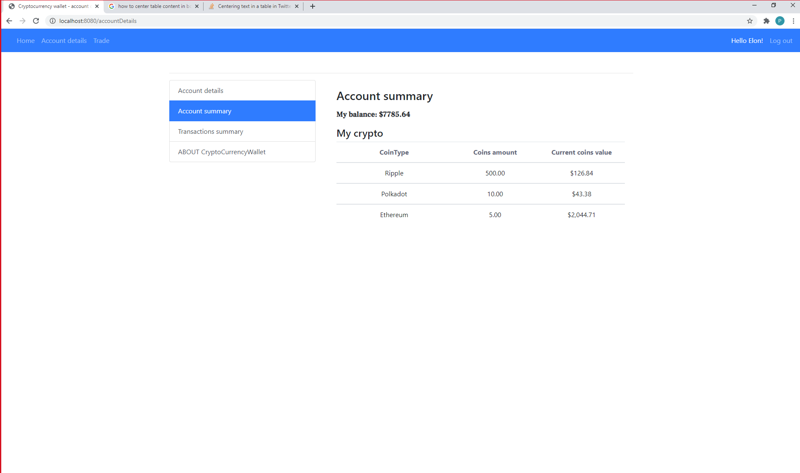
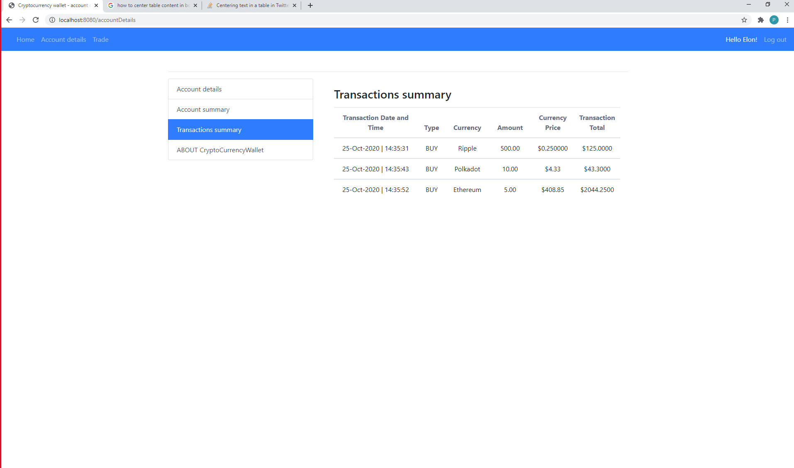

# Cryptocurrencywallet

## Description
Cryptocurrency wallet is a final project of Java software development bootcamp.
This app fetches the exchange rates from external REST API and enable registered users to buy or sell
cryptocurrencies. 

### Technologies used:
- Spring Boot with Spring Security, Hibernate, REST
- Thymeleaf, Bootstrap
- JavaScript, jQuery, Ajax
- JUnit 5
- Databases: MySLQ, H2 *(for tests)*

### Functionality:

- Main page with current cryptocurrency exchange rates.
- Buy/Sell transaction 
- Security - logging and registering users
- Updating user account details
- Detailed history of transactions
- Displaying user balance in USD and user cryptocurrency coins
- Separation of authorization - user and admin role.

### Launch:

To start using application, you need to first register by going to registration page. 

All registered users got $10000 to start trading. 

##### External API for fetching data:
https://nomics.com/

##### Authors

 * Paulina [GitHub](https://github.com/PaulinaCz) 
 * Pawel  [GitHub](https://github.com/KonarzewskiP) 
 * Adrian [GitHub](https://github.com/adrianlos) 
 * Lukasz [GitHub](https://github.com/LukaszLeszczynski89) 

-------------

